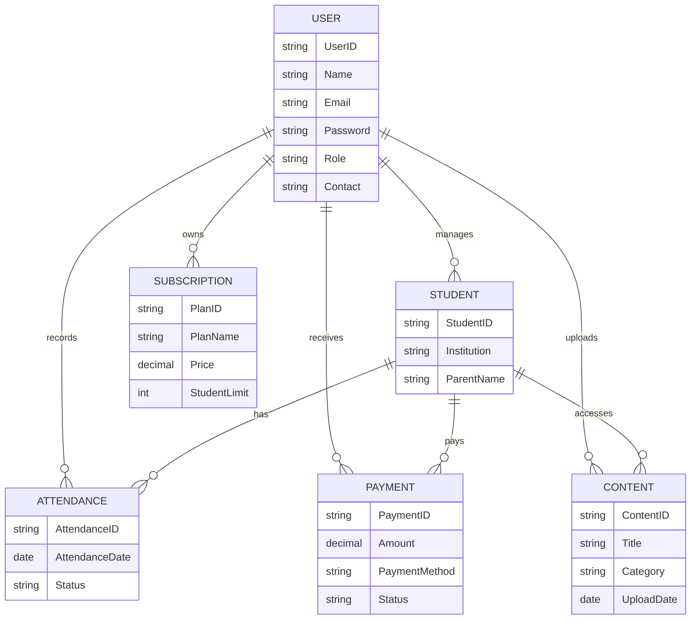

# 📚 Mentor's Diary – Smart Tutoring & Coaching Management System

<p align="center">
  
</p>

<p align="center">
  <a href="https://github.com/iammrranik">
    
  </a>
</p>

---

## ✨ Project Status

- 🚧 Software Engineering Academic Project
- 📖 Developed using the **Extreme Programming (XP)** methodology
- 🌐 Designed for Web & Mobile Platforms
- 🎯 Built for Private Tutors, Coaching Centers, Students and Parents
- 📚 Focused on simplifying tutoring management through digital transformation

---

# 📖 System Overview

**Mentor's Diary** is a modern tutoring and coaching management platform designed to help private tutors and small coaching centers efficiently manage their daily academic and administrative activities.

The application combines student management, attendance tracking, digital content sharing, fee management, communication, subscription plans, and financial reporting into one centralized platform.

Instead of maintaining spreadsheets, notebooks, messaging apps, and payment records separately, tutors can organize their complete teaching workflow from a single dashboard.

The platform is designed specifically for the Bangladeshi tutoring ecosystem while remaining scalable for broader educational environments.

---

# 🎯 Objectives

Mentor's Diary aims to:

- Digitize traditional tutoring management
- Reduce manual administrative work
- Improve communication among tutors, students, and parents
- Simplify fee collection and financial tracking
- Provide secure digital learning material distribution
- Improve student progress monitoring
- Create an organized and scalable tutoring environment

---

# 🚀 Key Features

## 🔐 Authentication & Security

- User Registration
- Secure Login
- Forgot Password
- Role-Based Access Control
- Session Management
- Secure User Authentication

---

## 👨‍🏫 Tutor Dashboard

- Personal Dashboard
- Student Management
- Attendance Management
- Fee Collection
- Payment Tracking
- Study Material Upload
- Student Performance Monitoring
- Communication Center

---

## 👨‍🎓 Student Portal

- Personal Profile
- Attendance Records
- Learning Materials
- Assignment Downloads
- Payment Summary
- Academic Progress
- Notifications

---

## 👨‍👩‍👧 Parent Portal

- Student Progress Monitoring
- Attendance Reports
- Payment History
- Due Balance Information
- Tutor Communication

---

## 📚 Student Management

- Add Student
- Update Student
- Remove Student
- View Student Profiles
- Student Search
- Academic Information Management

---

## 📅 Attendance Management

- Daily Attendance
- Attendance History
- Attendance Reports
- Automated Record Keeping
- Student Attendance Statistics

---

## 📂 Digital Content Sharing

- Upload Lecture Notes
- Upload Assignments
- Upload Recorded Lectures
- Organize Learning Materials
- Download Resources
- Categorized Content Library

---

## 💳 Fee Management

- Track Payments
- Record Transactions
- Due Balance Calculation
- Remaining Balance
- Financial Reports
- Payment History

Supported Payment Services

- bKash
- Nagad
- Google Pay

---

## 💬 Communication

- Tutor Announcements
- Student Notifications
- Parent Updates
- Academic Notices
- Learning Reminders

---

## ⭐ Subscription Management

### Free Plan

- Maximum 3 Students
- Basic Features
- Limited Dashboard Access

### Premium Plan

- Maximum 100 Students
- Unlimited Student Management
- Advanced Reports
- Premium Features
- Priority Support

---

# 👥 User Roles

| Role | Responsibilities |
|------|------------------|
| 👨‍🏫 Tutor | Manage students, attendance, study materials, payments and communication |
| 👨‍🎓 Student | Access learning resources, attendance records, academic progress and payment history |
| 👨‍👩‍👧 Parent | Monitor student performance, attendance and fee payments |
| 🛠 Administrator | Monitor the system, manage reports and oversee platform operations |

---

# 🛠 Technology Stack

| Category | Technology |
|----------|------------|
| Frontend | Flutter / React |
| Backend | ASP.NET Core Web API |
| Database | Firebase / SQL Server |
| Authentication | Secure Login & Role-Based Authentication |
| Payment Gateway | bKash, Nagad, Google Pay |
| API | REST API |
| Version Control | Git |
| Repository | GitHub |
| Development Model | Extreme Programming (XP) |

> **Note:** The technology stack reflects the project design documented in the Software Engineering report and can be adapted based on the final implementation.

---

# 🏗 Software Architecture

The application follows a modular architecture where each major component is responsible for a dedicated business process.

```
                 Web Application
                        │
                 Mobile Application
                        │
                RESTful API Services
                        │
        ┌───────────────┼───────────────┐
        │               │               │
 Authentication   Business Logic   Notifications
        │               │               │
        ├───────────────┼───────────────┤
        │               │               │
 Student Module  Attendance Module  Payment Module
        │               │               │
        ├───────────────┼───────────────┤
        │               │               │
 Content Module  Subscription Module Reports
                        │
                  Database Layer
```

---

# 📦 Functional Modules

## 🔐 Authentication Module

- Register
- Login
- Forgot Password
- Session Management
- User Authorization

---

## 👨‍🎓 Student Management Module

- Student Registration
- Student Information
- Profile Management
- Search Students
- Remove Students

---

## 📅 Attendance Module

- Mark Attendance
- Attendance History
- Attendance Reports
- Attendance Statistics

---

## 📚 Content Management Module

- Upload Notes
- Upload Assignments
- Upload Recordings
- Download Materials
- Learning Resources

---

## 💳 Payment Module

- Fee Collection
- Payment Tracking
- Transaction History
- Financial Reports
- Balance Calculation

---

## ⭐ Subscription Module

- Free Subscription
- Premium Subscription
- Upgrade Plan
- Subscription Management

---

# 🌟 Why Mentor's Diary?

✅ Centralized Tutoring Management

✅ Local Payment Integration

✅ Multi-Role Platform

✅ Organized Learning Resources

✅ Attendance Automation

✅ Financial Tracking

✅ Modern Dashboard

✅ Scalable Architecture

✅ User-Friendly Interface

---

# 🗄 Database Overview

The system stores and manages information related to users, students, attendance, digital learning resources, subscriptions, and financial transactions.



---

# 📂 Suggested Project Structure

```
MentorsDiary/
│
├── README.md
├── LICENSE
├── docs/
│   ├── Architecture.md
│   ├── Database.md
│   ├── Screenshots/
│   └── API.md
│
├── frontend/
│   ├── Web/
│   └── Mobile/
│
├── backend/
│   ├── Controllers/
│   ├── Services/
│   ├── Models/
│   ├── DTOs/
│   ├── Middleware/
│   ├── Repository/
│   └── Program.cs
│
├── database/
│   ├── SQL/
│   └── SeedData/
│
├── uploads/
│
└── tests/
```

---

# 🚀 Getting Started

## Prerequisites

- .NET SDK
- Flutter SDK (if mobile application is included)
- SQL Server / Firebase
- Git
- Visual Studio / Visual Studio Code

---

## Clone Repository

```bash
git clone https://github.com/yourusername/MentorsDiary.git

cd MentorsDiary
```

---

## Restore Dependencies

```bash
dotnet restore
```

---

## Build the Project

```bash
dotnet build
```

---

## Run the Application

```bash
dotnet run
```

---

# 📋 Typical Workflow

### Tutor

```text
Login
   │
Dashboard
   │
Add Student
   │
Take Attendance
   │
Upload Notes
   │
Collect Fees
   │
Generate Reports
```

---

### Student

```text
Login
   │
View Dashboard
   │
Access Notes
   │
Check Attendance
   │
View Payment Status
```

---

### Parent

```text
Login
   │
View Student Progress
   │
Check Attendance
   │
Pay Fees
   │
Receive Notifications
```

---

# 📈 Project Highlights

- 📚 Digital Student Management
- 📅 Automated Attendance Tracking
- 💰 Integrated Fee Management
- 📂 Organized Learning Materials
- 💬 Communication Dashboard
- ⭐ Subscription-Based Service
- 🔒 Secure Authentication
- 📊 Financial Reporting
- 📱 Mobile & Web Ready
- 🌍 Localized Payment Support

---

# 📸 Screenshots

> Added screenshots in report.

```
📷 Login Page

📷 Tutor Dashboard

📷 Student Dashboard

📷 Parent Dashboard

📷 Attendance Module

📷 Student Management

📷 Content Sharing

📷 Payment Management

📷 Subscription Page

📷 Reports Dashboard
```

---

# 🛣 Future Roadmap

- 📊 Advanced Analytics Dashboard
- 💬 Real-Time Chat System
- 🎥 Zoom / Google Meet Integration
- 📱 Dedicated Parent Mobile App
- 🤖 AI-Based Student Performance Analysis
- 📧 Email & SMS Notifications
- 🏆 Student Achievement Badges
- ☁ Cloud Storage Integration
- 🌍 Multi-Language Support
- 📈 Business Intelligence Reports

---

# 🤝 Contributing

Contributions are welcome.

If you would like to improve this project:

1. Fork the repository
2. Create a feature branch

```bash
git checkout -b feature/NewFeature
```

3. Commit your changes

```bash
git commit -m "Add new feature"
```

4. Push your branch

```bash
git push origin feature/NewFeature
```

5. Open a Pull Request

---

# 📄 License

This project was developed for academic and educational purposes.

Feel free to use it for learning, research, and portfolio demonstrations.

---

# 🙏 Acknowledgements

Special thanks to:

- Faculty members for continuous guidance
- Team members for collaboration
- Fellow students for testing and valuable feedback
- The open-source community for providing amazing tools and resources

---

# 👨‍💻 Developed By

**Mrr Anik**

Computer Science & Engineering Student

Cybersecurity Enthusiast • Software Developer • Problem Solver

<p align="center">
    <a href="https://github.com/iammrranik">
        
    </a>
</p>

---

<p align="center">
    ⭐ If you found this project helpful, consider giving it a star!
</p>

<p align="center">
    
</p>
